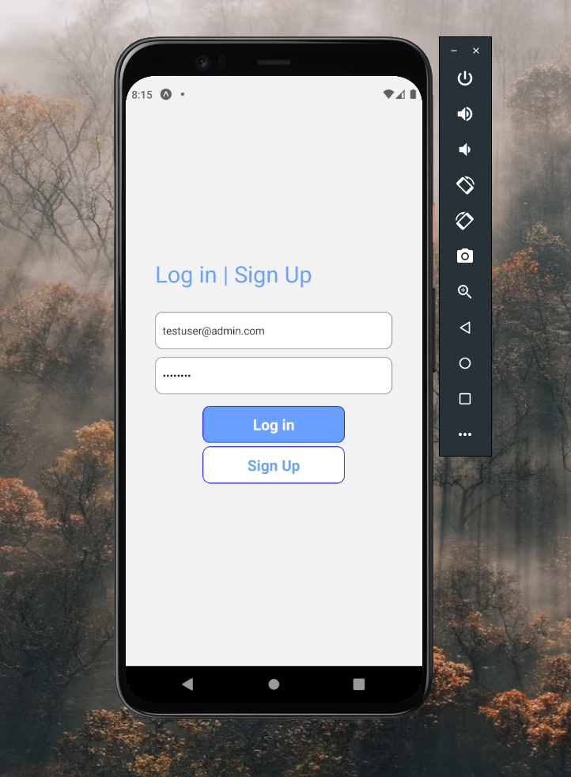
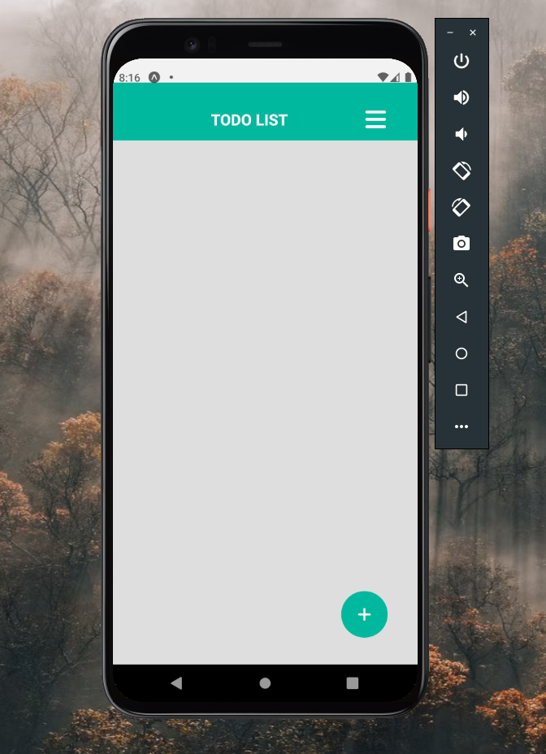
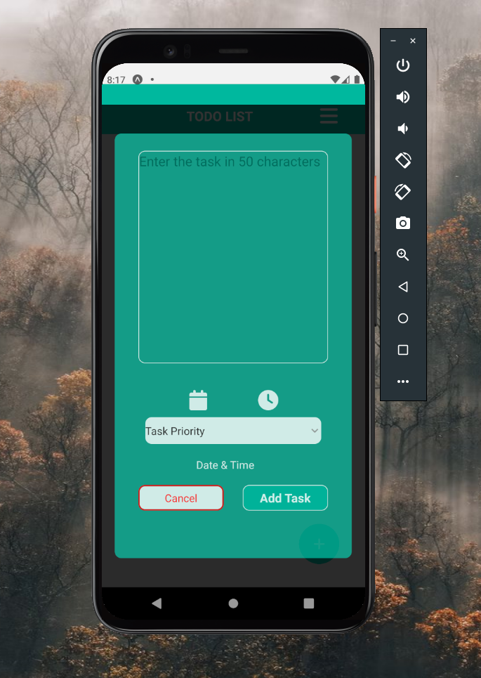
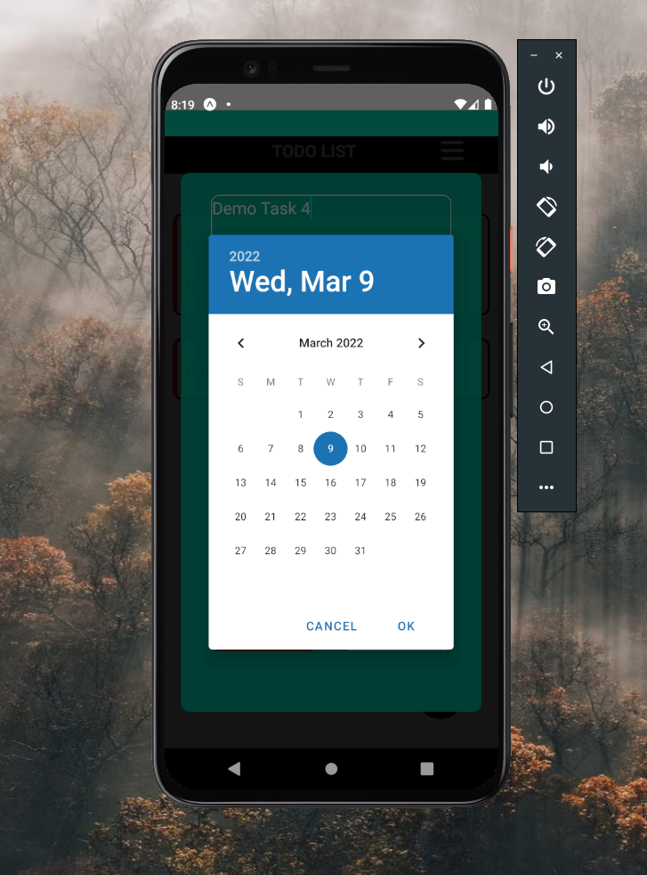
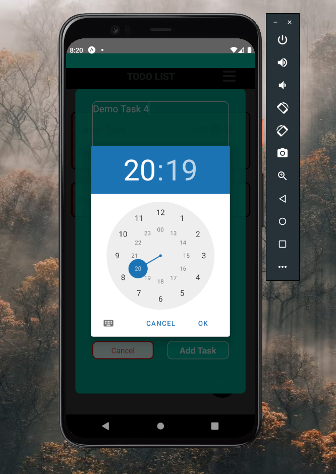
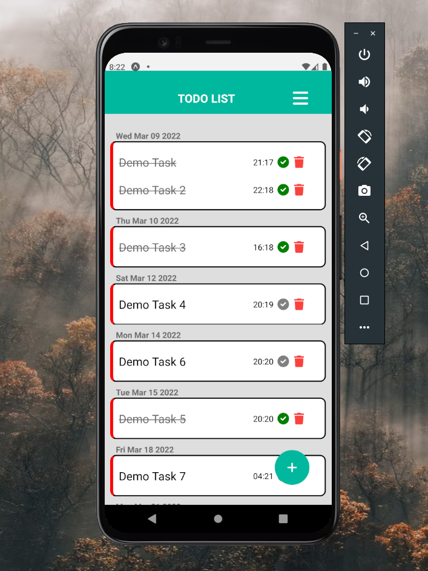
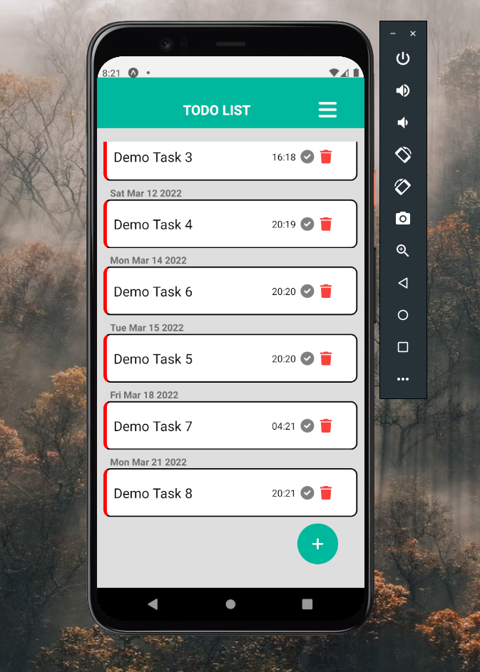
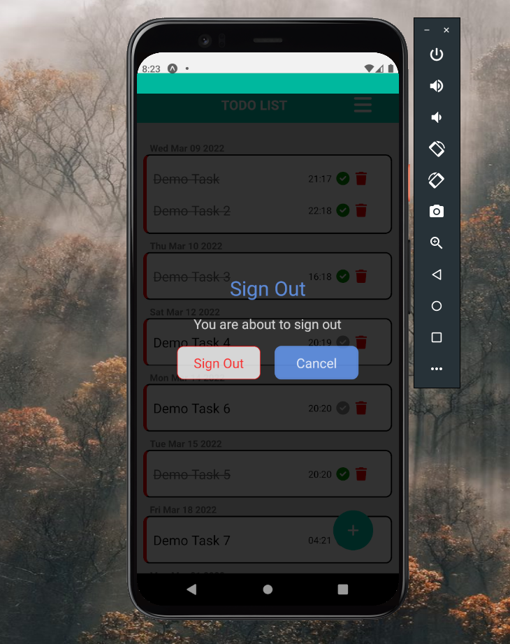
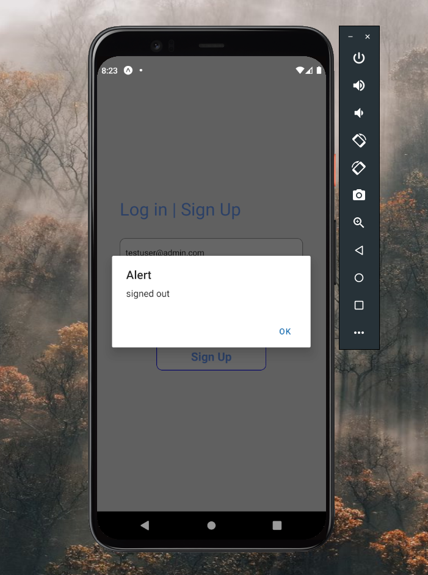

# TaskManager-ReactNative

## Technologies used :
1. React Native 
2. React Hooks 
3. React Navigation
4. FontAwesome
5. Firebase authentication
6. React Datetime picker 
7. UUID for react-native 

## User expreience through screenshots :

### Login Screen

### Home Screen

### Create New Tasks 

### Demo Feed

### Sign out

